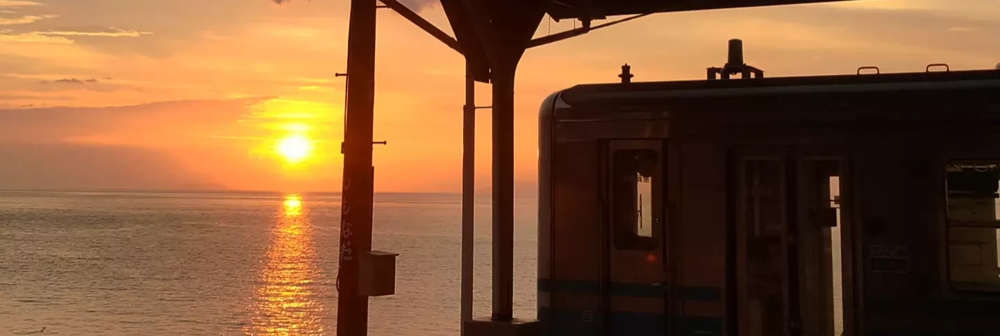

  

<h1 align="center">👋 Welcome to OceanT-shirt's Repo!</h1>

<h3 align="center">Modern Technology Enthusiast from Japan 🇯🇵</h3>

<h3 align="center">🌟 🌟 🌟</h3>

⛓ Blockchain / Dapps

🧠 Machine Learning

🌍 3D Modeling

🎥 Animation Editing

 

 

<!--
**OceanT-shirt/OceanT-shirt** is a ✨ _special_ ✨ repository because its `README.md` (this file) appears on your GitHub profile.

Here are some ideas to get you started:

- 🔭 I’m currently working on ...
- 🌱 I’m currently learning ...
- 👯 I’m looking to collaborate on ...
- 🤔 I’m looking for help with ...
- 💬 Ask me about ...
- 📫 How to reach me: ...
- 😄 Pronouns: ...
- ⚡ Fun fact: ...
-->

Photo: Shimonada Station (Japan)
